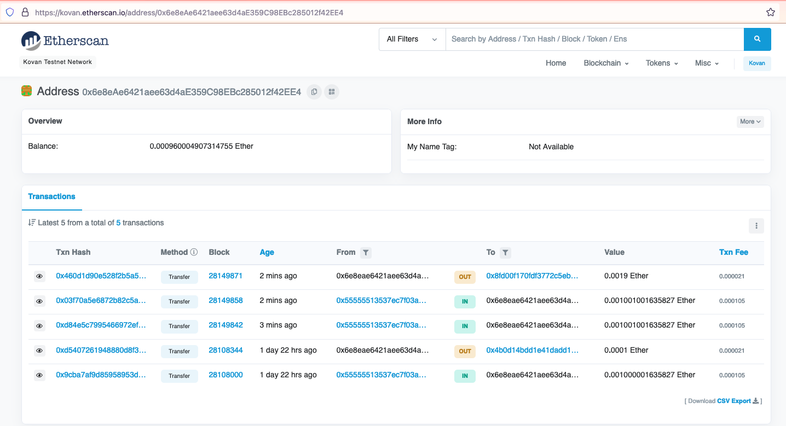
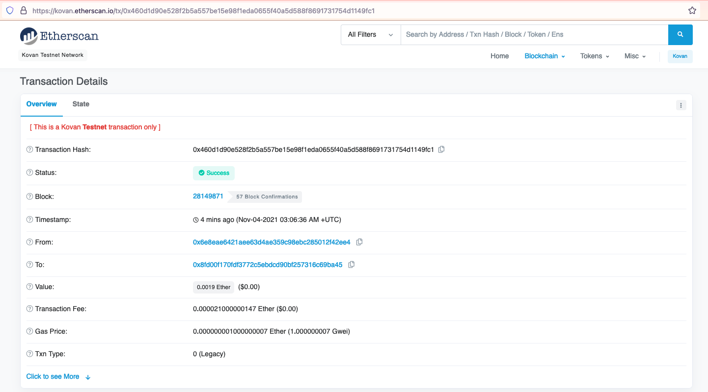
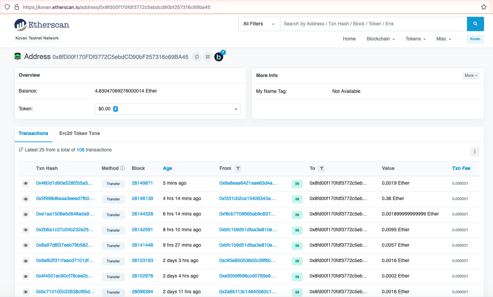

## Module 2 Challenge

### What is submitted

* [Fintech Finder](Code/fintech_finder.py)

### Proof of transaction

* Account details (balance and transaction history) of sender account
    

* Transaction details showing wage payment
    

* Recipient account transaction history
    
© 2019 Trilogy Education Services, a 2U, Inc. brand. All Rights Reserved.
